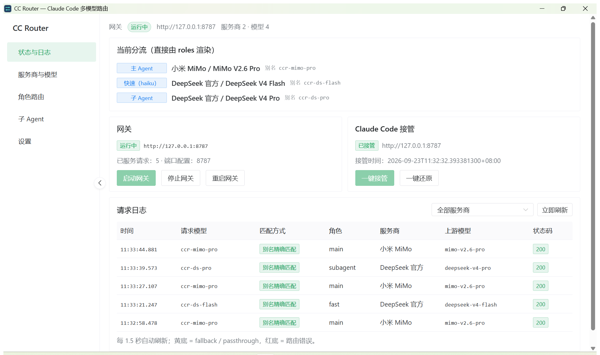
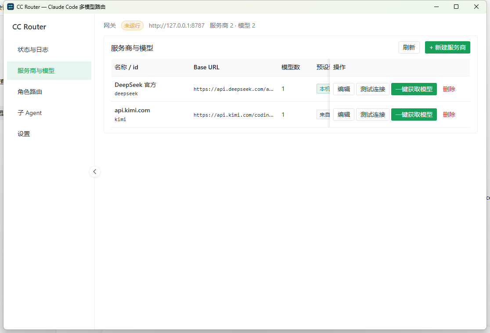
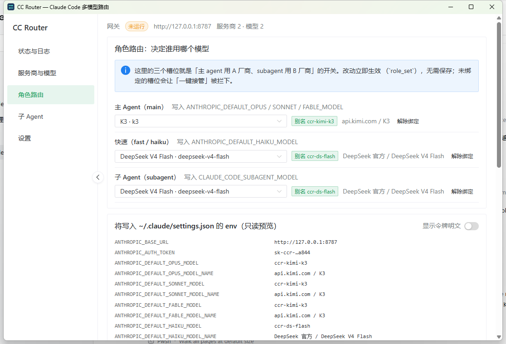

# CC Router

**让 Claude Code 同时用多家模型厂商：主 agent 用一家，subagent 用另一家。**

*A local, multi-vendor routing gateway for Claude Code — main agent and subagents can run on different providers.*

Claude Code 只能配置**一个**第三方模型端点（一个 `ANTHROPIC_BASE_URL` + 一把密钥）。所以「主 agent 用 Kimi、subagent 用 DeepSeek」这类需求，靠配置本身做不到——它们域名不同、密钥也不同。

CC Router 在本机起一个路由网关。Claude Code 指向这个网关，网关**按请求体里的 `model` 字段**把请求分发到不同厂商的 Anthropic 兼容端点：

```
                        ┌──────────────────────────────────────┐
   claude.exe ─────────▶│  CC Router 网关  http://127.0.0.1:8787 │
   （只认一个端点）      │  别名 → (厂商, 真实模型) 的路由表       │
                        └───────┬──────────────────────┬───────┘
                                │                      │
                    主 agent ───┘                      └─── subagent
                    ccr-kimi-k3                            ccr-ds-flash
                                │                      │
                                ▼                      ▼
                     Kimi /anthropic            DeepSeek /anthropic
                        （A 厂商的密钥）           （B 厂商的密钥）
```

- **纯本地**：网关只监听 `127.0.0.1`，密钥只存在你自己的机器上，不经过任何第三方服务，**无遥测**。
- **不改 Claude Code 的调用方式**：只在 `~/.claude/settings.json` 里写入指向本机网关的环境变量，且**可逐字节还原**。
- **Windows 桌面应用**：Tauri 2 + Rust 网关 + Vue 3 界面，免管理员安装（约 3 MB 安装包）。

---

## 目录

- [截图](#截图)
- [快速开始](#快速开始)
- [工作原理](#工作原理)
- [接管改了什么，怎么还原](#接管改了什么怎么还原)
- [主 agent 与 subagent 用不同厂商](#主-agent-与-subagent-用不同厂商)
- [界面](#界面)
- [请求日志怎么读](#请求日志怎么读)
- [故障排查](#故障排查)
- [隐私与安全](#隐私与安全)
- [已知限制](#已知限制)
- [开发与构建](#开发与构建)
- [与 cc-switch 的关系](#与-cc-switch-的关系)
- [许可](#许可)

---

## 截图

状态与请求日志——每次请求命中了哪个厂商、哪个模型，一眼可见（表中 `main` 走小米 MiMo、`subagent` 走 DeepSeek）：



服务商与模型——内置 90+ 家厂商预设，也可自定义；「操作」列固定在右侧，编辑 / 测试连接 / 一键获取模型 / 删除都够得到：



角色路由——三个槽位分别决定主 agent、快速任务（haiku）、子 agent 用哪个模型，并实时预览将写入 `settings.json` 的内容：



> 截图里的厂商名（小米 MiMo / DeepSeek / Kimi）来自开发机的真实配置，仅作演示；**不含任何密钥**。

---

## 快速开始

### 1. 安装

从 [Releases](../../releases) 下载 `CC.Router_<版本>_x64-setup.exe` 双击安装。

> GitHub 会把资产名里的空格规范化成 `.`。本地产物名是 `CC Router_<版本>_x64-setup.exe`，两者是同一个文件。

- 系统要求：**Windows 10/11 x64**，WebView2 运行时（Windows 11 自带；缺失时安装程序会**自动下载安装** WebView2 Bootstrapper）。
- **免管理员**：按当前用户安装到 `%LOCALAPPDATA%\CC Router`，同时创建开始菜单快捷方式与标准卸载项。

### 2. 加服务商

在「服务商与模型」页选一个**厂家预设**（内置 93 条，可搜索、按分类分组），或者点「+ 新建服务商」自定义——只需要 **Base URL** 和 **API Key** 两栏，然后点「创建并获取模型」，模型列表会自动拉取。

> 内置预设里 **7 条标记为「不支持」并禁用**：5 条需要 OpenAI/Gemini 协议转换，2 条是 AWS Bedrock（需要 Claude Code 带厂商凭证直连、会绕过本网关）。它们仍列在列表里，附原因。

### 3. 分配模型

在「角色路由」页给三个角色各挑一个模型：

| 角色 | 作用 | 写入 Claude Code 的键 |
|---|---|---|
| **主 Agent**（main） | 主对话模型 | `ANTHROPIC_DEFAULT_OPUS_MODEL` / `_SONNET_MODEL` / `_FABLE_MODEL` |
| **快速任务**（fast） | Claude Code 的后台小任务 | `ANTHROPIC_DEFAULT_HAIKU_MODEL` |
| **子 Agent**（subagent） | 所有 subagent 的默认模型 | `CLAUDE_CODE_SUBAGENT_MODEL` |

**想做「主 agent 用 A 厂商、subagent 用 B 厂商」，就是在这里把 main 与 subagent 指到不同厂商的模型。**

### 4. 一键接管

回「状态与日志」页点「一键接管」。它会改 `~/.claude/settings.json` 让 Claude Code 走本网关，并**先把原文件逐字节备份**。

### 5. 开始用

打开一个**新的** `claude` 会话即可。状态页的请求日志会实时显示每次请求命中了哪个厂商、哪个模型。

---

## 工作原理

关键概念是**别名**（alias）：每个已配置模型会得到一个稳定的虚拟 ID（如 `ccr-deepseek-deepseek-v4-pro`）。Claude Code 只会看到别名，网关负责把别名换回厂商的真实模型名、并注入该厂商的密钥。

路由顺序（`src-tauri/src/routing/resolve.rs`）：

1. **别名精确匹配**（去空白、小写化，并剥掉 Claude Code 追加的 `[1M]` 后缀）→ `matchedBy = alias`
2. 否则若请求的是 **Claude 家族名**（`claude-opus-*` / `sonnet` / `fable` / `haiku-*`）→ 按配置的角色兜底 → `matchedBy = family`
3. 否则按**未知模型策略**处理：`default` 转发到「默认目标」（`matchedBy = fallback`）或 `error` 直接返回 400（`matchedBy = error`）
4. 非 `/v1/messages` 的其它路径整体转发到默认目标（`matchedBy = passthrough`）

所以换厂商、换模型都**不用动 Claude Code 的配置**——回状态页点一次「应用到 Claude Code」即可。

---

## 接管改了什么，怎么还原

接管只在 `~/.claude/settings.json` 的 `env` 里写这些键：

| 键 | 值 |
|---|---|
| `ANTHROPIC_BASE_URL` | `http://127.0.0.1:<端口>` |
| `ANTHROPIC_AUTH_TOKEN` | 本应用生成的**本地令牌**（真厂商密钥不进这个文件） |
| `ANTHROPIC_DEFAULT_OPUS_MODEL` / `_SONNET_MODEL` / `_FABLE_MODEL` | main 角色模型的**别名** |
| `ANTHROPIC_DEFAULT_HAIKU_MODEL` | fast 角色模型的别名 |
| `CLAUDE_CODE_SUBAGENT_MODEL` | subagent 角色模型的别名 |
| 上述四个键的 `_MODEL_NAME` | 人类可读展示名，形如 `DeepSeek 官方 / DeepSeek V4 Pro`（`CLAUDE_CODE_SUBAGENT_MODEL` 没有配套变量，Claude Code 未提供） |

同时**移除**三个会绕过别名路由的旧键：`ANTHROPIC_MODEL`、`ANTHROPIC_API_KEY`、`ANTHROPIC_SMALL_FAST_MODEL`。

**其它键一律不动**——`env` 里的 `API_TIMEOUT_MS`、`CLAUDE_CODE_EFFORT_LEVEL` 之类，以及顶层的 `attribution`、`permissions`，都不碰。

**还原是逐字节可逆的**：

- 接管前把 `settings.json` 的**原始字节**备份到 `%APPDATA%\cc-router\backups\settings.json.<时间戳>.pre.bak`，接管后的内容也留一份 `.post.bak`。
- 点「一键还原」时：若文件自接管以来没被别的程序改过，直接写回 `.pre.bak` 的原始字节——**保证逐字节等于接管前**；若被外部改过，则按还原清单做**合并式回放**（恢复我们改过的键、保留别人新增的键），并明确告诉你走的是哪条路径。
- 状态页在 `settings.json` 被外部程序改写时显示告警。
- **应用退出/卸载不会自动还原**：卸载前请先点一次「一键还原」，否则 Claude Code 会继续指向一个已经不存在的端口。（设置页另有「退出应用时自动还原」开关，默认关闭。）

---

## 主 agent 与 subagent 用不同厂商

有两层，别混淆：

| | 「角色路由」页的 `subagent` 槽位 | 「子 Agent」页 |
|---|---|---|
| 写到哪 | `settings.json` 的 `CLAUDE_CODE_SUBAGENT_MODEL` | `~/.claude/agents/*.md` 的 frontmatter `model:` 行 |
| 管谁 | **所有**子 Agent 的默认模型 | **某一个具名**子 Agent 的覆盖 |
| 需要它吗 | 只想给子 Agent 一个模型 → 只配这里就够 | 想让某个子 Agent（如 `reviewer`）用别的模型 → 才需要 |

「子 Agent」页是**可选的覆盖层**，一个都不建时它什么也不做。页内三种写法：

- **跟随主模型** → 写 `model: inherit`（与主 agent 同模型）
- **使用 subagent 默认** → **删掉** `model` 行（于是回落到角色路由页的 subagent 槽位）
- **指定模型** → 写 `model: <别名>`

改动只针对 `model` 这一行，frontmatter 其它字段与正文**逐字节保留**；删除或改动前都会先备份到 `%APPDATA%\cc-router\backups\agents\`，页底的「已删除 / 已备份的子 Agent」清单会列出这些备份，**点路径即可复制**，也可以逐条删除。

---

## 界面

| 页面 | 作用 |
|---|---|
| 状态与日志 | 网关启停、端口、接管状态、**实时请求日志**（时间 / 请求模型 / 命中方式 / 角色 / 厂商 / 上游模型 / 状态码 / 是否流式 / 延迟） |
| 服务商与模型 | 增删改服务商与模型；厂家预设；自定义；测试连接；一键获取模型 |
| 角色路由 | main / fast / subagent 三个角色挑模型；额外别名规则；未知模型策略；只读 env 预览 |
| 子 Agent | 管理 `~/.claude/agents/*.md` 的 `model` 字段；备份清单（可复制路径、可删除） |
| 设置 | 端口、开机自启、关窗行为、本地令牌、备份列表、配置导入导出、关于 |

托盘常驻：关窗默认最小化到托盘（网关继续运行，Claude Code 随时可用），托盘右键可启停网关、接管、还原、退出。**再次启动应用不会开出第二个窗口**——它会把已有窗口拿到前台。

---

## 请求日志怎么读

日志里的「命中方式」（`matchedBy`）：

| 值 | 含义 |
|---|---|
| `alias` | 精确命中了模型别名（正常情况） |
| `family` | 请求里是 Claude 家族名（`claude-opus-*` / `sonnet` / `fable` / `haiku-*`），按角色兜底 |
| `fallback` | 未知模型，按「未知模型策略」落到了默认目标 |
| `passthrough` | 非 `/v1/messages` 的路径，整体转发到默认目标 |
| `error` | 路由失败（没命中且策略为 `error`），本次返回 400 |

无令牌 / 令牌不匹配的请求**不会**被计入 `requestsServed`。

---

## 故障排查

| 现象 | 原因 / 处理 |
|---|---|
| Claude Code 报连不上 / 连接被拒绝 | 网关没在跑。回状态页点「启动网关」 |
| 一打开 Claude Code 就报错，状态页显示「接管已失效」 | `settings.json` 被别的程序（多半是 cc-switch）改写了。点「重新接管」或「还原」 |
| 日志里某条请求 `status` 是 401 | 上游厂商拒绝了密钥。去服务商页点「测试连接」看具体错误 |
| 日志里某条 `status` 是 404 | 上游不认识这个模型名。确认该模型的**上游模型 ID** 拼写与厂商文档一致 |
| 日志里出现 `matchedBy=fallback` | 请求的模型名没有任何别名命中，被兜底转发了。要么绑定正确的模型，要么把未知模型策略改成 `error` 以便尽早暴露问题 |
| 502 | 网关连不上上游（DNS/网络/厂商故障）。错误消息里带 `provider=` 与别名 |
| 504 | 上游连上了但超时（非流式响应体在 `idleTimeoutMs` 内没读完，或流式空闲超时） |
| 端口 8787 被占用 | 设置页换一个端口，然后点「立即重启网关」 |
| 改完角色/模型没生效 | 回状态页点「应用到 Claude Code」，然后**新开**一个 `claude` 会话（已运行的会话读的是启动时的环境变量） |

---

## 隐私与安全

- **明文密钥警示**：`%APPDATA%\cc-router\config.json` **以明文保存各厂商的 API Key**（与 Claude Code 自身把密钥明文放在 `settings.json` 里同一信任边界）。**不要**把这个文件提交到 git、贴到聊天里、或放进同步盘。设置页的「导出配置」提供**移除密钥**的选项。
- 网关只监听 `127.0.0.1`（不对外暴露），除 `GET /ccr/health` 之外所有请求都要求本地令牌；写入 Claude Code 的也只有这个本地令牌。
- 除转发 Claude Code 的请求、以及你在「测试连接」「一键获取模型」时主动发起的请求之外，**本应用不发起任何网络连接，也不采集任何遥测**。

---

## 已知限制

诚实清单——这些是这一版**没做**的：

- **接管是「全量」的**：一次接管让 Claude Code 的所有模型都走本网关，没有「只接管某几个模型」的开关。
- **备份只用于还原，不能在界面上「还原到某个历史备份」**：能列出备份文件、能复制路径、能删除，但一键还原走的是「接管前那一份 + 还原清单」。
- **子 Agent 页只改 frontmatter 里的 `model:` 行**，不支持编辑 frontmatter 的其它字段或正文。
- **请求日志**：后端在内存里保留最近 **500** 条（重启即清空），界面只展示最近 **200** 条（每 1.5 秒刷新）。
- **服务商的 `id` 由名称推导且创建后不可改**（改 id 会让已有别名与角色绑定失效）；显示名称可以随便改。
- **「测试连接」的结果不会写回预设目录**：预设的「已验证」标记是构建时就固定的（内置 93 条里 3 条在本机实测过），不是你在界面上点出来的。
- **标记为「不支持」的预设**（7 条）只是禁用并附原因，本版本不做协议转换。

---

## 开发与构建

需要 Rust（stable）、Node.js 20+、pnpm。

```bash
pnpm install
cargo test --manifest-path src-tauri/Cargo.toml     # 后端测试（当前 190 passed / 0 failed / 2 ignored）
pnpm tauri dev                                      # 开发模式启动桌面应用
pnpm tauri build                                    # 产出 NSIS 安装包
```

按磁盘配置**手工启动网关**（没有 UI 时用来联调，会打印别名路由表）：

```bash
cargo run --manifest-path src-tauri/Cargo.toml --example serve
curl -s http://127.0.0.1:8787/ccr/health
```

仓库结构：

```
src/                     前端（Vue 3 + TypeScript + Naive UI）
  api/ipc.ts             与后端唯一通道（全部 invoke 调用都在这里）
  views/                 五个页面
src-tauri/src/
  config/                配置模型 / 校验 / 原子写
  routing/               别名生成与路由解析
  gateway/               HTTP 网关（hyper）：改写、注入密钥、零缓冲 SSE 透传
  claude/                settings.json 接管与逐字节还原、子 Agent 文件管理
  preset/ provider/      预设目录、服务商与模型拉取
  tray.rs autostart.rs   托盘、开机自启（HKCU Run，不加新依赖）
  single_instance.rs     单实例守卫（回环端口 + 口令握手）
tools/build-presets.mjs  从上游原始数据生成 presets.json
docs/                    设计规格、实施计划与界面截图
```

配置与备份的位置：

| 路径 | 内容 |
|---|---|
| `%APPDATA%\cc-router\config.json` | 全部配置（**含明文密钥**） |
| `%APPDATA%\cc-router\presets.user.json` | 可选：覆盖/追加厂家预设（同 `id` 覆盖内置），厂商改地址不必等应用发版 |
| `%APPDATA%\cc-router\backups\` | 接管前的 `settings.json` 原始字节备份；`backups\agents\` 是子 Agent 文件的备份 |
| `%APPDATA%\cc-router\logs\` | 应用日志（打开请求日志落盘开关时还有 `requests-YYYY-MM-DD.jsonl`） |

---

## 与 cc-switch 的关系

[cc-switch](https://github.com/farion1231/cc-switch) 和本应用**都会写** `~/.claude/settings.json`。两者同时启用时必然互相覆盖，建议二选一：

- 用 CC Router 做路由 → 在 cc-switch 里关闭它的本地代理/路由模式；
- 或者干脆只用其中一个。

本应用**不会**为了抢回配置而反复重写，只会在状态页告警。

厂家预设数据（内置 `presets.json`，93 条厂商连接信息）来自该项目，遵循 **MIT 许可证**（Copyright © 2025 Jason Young），许可证全文见应用「设置 → 关于」页，仓库内副本见 [`docs/reference/cc-switch-LICENSE.txt`](docs/reference/cc-switch-LICENSE.txt)。

迁移时**不搬运任何第三方推广关系**：链接（`websiteUrl` / `apiKeyUrl`）采用**白名单**——只保留确认有功能作用的参数（`apikey` / `redirect` / `tab`），其余参数一律剥离并在生成预设时逐条打印；路径或保留参数里带上游项目推广标记、以及无法判断落点的不透明短链，整条置空。

---

## 许可

本项目采用 **MIT 许可证**，见 [LICENSE](LICENSE)。

内置厂家预设数据来自 [cc-switch](https://github.com/farion1231/cc-switch)（MIT，Copyright © 2025 Jason Young），其许可证全文随本仓库提供。
